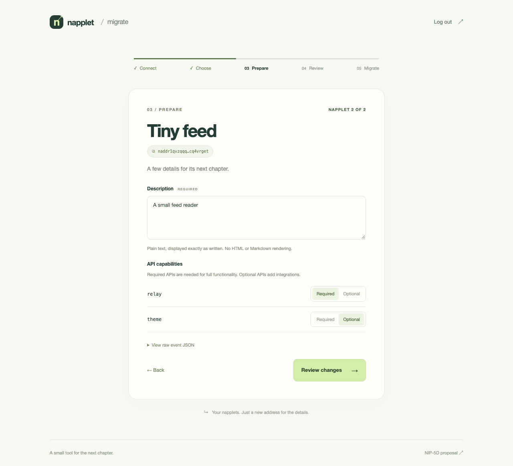

<div align="center">

# Napplet Migrate

Prepare, review, and publish napplet manifests for the proposed NIP-5D schema.

[](https://github.com/napplet/migrate/actions/workflows/ci.yml)
[](https://nodejs.org/)

</div>

A browser-only migration wizard built with Svelte 5, TypeScript, Tailwind CSS, and Vite. Connect a Nostr signer, load your napplets or another author’s `naddr`, and review every change before signing and publishing. No backend, account database, or private-key entry is required.

<p align="center">
  
</p>

## Quick start

Install **Node.js 24 or newer**, then run:

```sh
git clone https://github.com/napplet/migrate.git
cd migrate
npm ci
npm run dev
```

Open the local URL printed by Vite. Local development needs no environment variables; connect a NIP-07 browser extension or NIP-46 remote signer when ready to migrate.

## Migrate a napplet

1. **Connect** with an extension, scan a NostrConnect QR code, or paste a bunker URI.
2. **Choose** from your napplets or enter any napplet `naddr`. Select one or several events.
3. **Prepare** each description and mark APIs required or optional. `theme` starts as optional.
4. **Review** the changes and before/after JSON. Download the original events as a backup.
5. **Migrate** to sign and publish. Inspect relay receipts and download the signed results.

Truncated address bubbles copy the full `naddr` when clicked. Results show the migrated event’s address; immutable snapshots use `nevent` references. During preparation, **View raw event JSON** exposes the original signed event, including when validation blocks review. Validation messages show the problematic entry’s exact value and array index.

### Signers and relays

The remote signer connection relay defaults to `wss://bucket.coracle.social` and can be changed before connecting. This setting overrides the relay in a bunker URI, so the signer must listen there. Approval links appear when requested; connection keys are ephemeral and discarded on logout or refresh.

Discovery and publication use a separate, editable relay list derived from your latest verified **NIP-65 (`kind:10002`) event**:

- Write relays and unmarked read/write relays are included; read-only relays are excluded.
- If no list is available, the app offers fallback relays. An explicitly empty or read-only list requires adding a write relay.
- Looking up another author’s `naddr` also checks their NIP-65 write relays and the address’s relay hints.

Copies of another author’s napplet are signed by **your connected account** and published to **your relays**. The source event remains intact. A copy can replace an existing manifest under your account with the same kind and identifier, or your root manifest for kind `15129`; inspect the review before publishing.

## Schema and compatibility

The migration targets [PR #7](https://github.com/dskvr/nips/pull/7) at pinned revision [`4d0fb2e`](https://github.com/dskvr/nips/blob/4d0fb2e9fa1fdca71be09b17a4c5f382fbca5d51/5D.md). This is a proposal, and the app does not automatically follow later revisions.

| Legacy manifest                | Migrated manifest                                              |
| ------------------------------ | -------------------------------------------------------------- |
| `description` tag              | Required nonempty plain-text event `content`                   |
| `path /index.html <hash>`      | Exactly one `x <artifact-hash>` tag                            |
| `x <aggregate-hash> aggregate` | Removed; never reused as the artifact hash                     |
| `requires <domain>`            | Your choice of `R <domain>` or `O <domain>`                    |
| Metadata and extension tags    | Valid metadata and unknown tags retained; obsolete `C` removed |

**Source references:** HTTP(S), `git://`, [NIP-34 `nostr://` Git repository URLs](https://github.com/nostr-protocol/nips/blob/master/34.md), and Blossom references, including [BUD-10 URIs](https://github.com/hzrd149/blossom/blob/master/buds/10.md) with discovery hints. Legacy hash-only and `blossom://` forms are also supported. This extends the pinned draft’s HTTP(S)-only source wording. References are preserved exactly without fetching their contents.

**Descriptions:** displayed literally, with no HTML or Markdown rendering. Validation rejects empty text and non-text control characters; punctuation that resembles formatting is allowed, with no imposed length limit.

**Event identity:** kinds remain `5129`, `15129`, and `35129`. Replaceable manifests retain their kind and identifier and receive a newer timestamp. Migrating your own replaceable event preserves its address; copying another author’s event changes the address to your account. Snapshots produce new events.

**Automatic migration limits:** ambiguous identifiers, malformed structural metadata, and multi-file manifests block migration. Rebundle multi-file artifacts first. Invalid optional icons are removed with a review note. The artifact itself is never fetched, changed, executed, or uploaded; its hash comes from the original signed `/index.html` path.

Signatures, authorship, and exact signer output are verified before publication. Success requires at least one positive relay acknowledgement; partial failures are listed. Retrying a failed publication reuses the signed event. Discovery depends on the configured relays’ available history, and immutable legacy snapshots may remain discoverable after migration.

## Development and checks

```sh
npm run check
npm test
npm run build
npx playwright install chromium
npm run test:e2e
```

Use `npm run preview` to serve a production build locally. Browser tests also run against the production build and cover desktop and mobile layouts, batch migration, cross-author copies, clipboard behavior, validation context, and encrypted NIP-46 exchanges with a test signer and relay.

Unit tests cover schema conversion, metadata preservation, signature checks, cancellation, retries, and deployment scripts. Tests use controlled keys and relays. See the [verification report](docs/verification.md) for recorded results and scope.

## Deploy to Bunny

1. Create a Bunny **Storage Zone** dedicated to this app and a **Pull Zone** connected to it. Set the default root object to `index.html`, enable HTTPS, and attach your hostname. The app uses no nested routes.
2. Authenticate the GitHub CLI with `gh auth login`, using an account with repository administration and secret-management access.
3. Run `npm run setup:github` in an interactive terminal. It detects the repository, creates the `production` environment if missing, and prompts for each setting below. Secret input is hidden; press Enter to retain an existing value. Re-running is safe.
4. Push to `main` or manually run [Deploy](https://github.com/napplet/migrate/actions/workflows/deploy.yml) from that branch. The workflow checks types, unit tests, the production build, and browser tests before uploading that build.

| GitHub environment setting | Type     | Value                                                                                       |
| -------------------------- | -------- | ------------------------------------------------------------------------------------------- |
| `BUNNY_STORAGE_ZONE`       | Variable | Storage zone name                                                                           |
| `BUNNY_STORAGE_HOST`       | Variable | Primary region hostname from Storage → FTP & API access; defaults to `storage.bunnycdn.com` |
| `BUNNY_STORAGE_PASSWORD`   | Secret   | Writable storage password from Storage → FTP & API access                                   |
| `BUNNY_PULL_ZONE_ID`       | Variable | Numeric ID from the pull zone dashboard URL                                                 |
| `BUNNY_API_KEY`            | Secret   | Account API key, used for cache purging                                                     |

Setup accepts `GITHUB_REPOSITORY=owner/repo` and `GITHUB_ENVIRONMENT=production` overrides. If you choose another environment name, update the deployment workflow to match. The setup script configures GitHub for existing Bunny resources; it does not create those resources.

Assets upload before `index.html`, and old hashed assets remain available for cached pages and open tabs. Cache purging starts only after every upload succeeds; upload or purge failures fail the workflow. Deployment credentials never enter the Vite build.

## Project structure

```text
.github/
└── workflows/           # CI and verified Bunny deployment
docs/
├── images/              # App screenshots
└── verification.md      # Acceptance evidence and test scope
scripts/                 # GitHub setup, Bunny deployment, and script tests
src/
├── components/          # Signer connection and copyable address bubbles
├── lib/                 # Schema, Nostr, address, and batch logic; unit tests
├── App.svelte           # Migration wizard
├── main.ts              # Browser entry point
└── style.css            # Shared styles and theme
tests/
├── fixtures/            # Signed event regression fixture
├── migration.spec.ts    # Desktop and mobile migration flows
└── remote-signer.spec.ts # Encrypted NIP-46 flows
package.json             # Commands and dependencies
playwright.config.ts     # Browser test configuration
vite.config.ts           # Build and unit test configuration
```

## Reference

| Resource                                                                                                                                                                                                      | Contents                                                    |
| ------------------------------------------------------------------------------------------------------------------------------------------------------------------------------------------------------------- | ----------------------------------------------------------- |
| [Verification report](docs/verification.md)                                                                                                                                                                   | Acceptance coverage, local results, and verification limits |
| [Migration rules](src/lib/migration.ts)                                                                                                                                                                       | Validation, defaults, transformation, and deduplication     |
| [Nostr integration](src/lib/nostr.ts)                                                                                                                                                                         | Signers, NIP-65 discovery, and publication                  |
| [CI workflow](.github/workflows/ci.yml)                                                                                                                                                                       | Checks on pull requests and pushes to `main`                |
| [Deployment workflow](.github/workflows/deploy.yml)                                                                                                                                                           | Tested build upload to Bunny                                |
| [Bunny storage API](https://github.com/BunnyWay/documentation/blob/main/api-reference/storage/openapi.json) / [core API](https://github.com/BunnyWay/documentation/blob/main/api-reference/core/openapi.json) | Deployment and cache-purge API contracts                    |

For fixes or improvements, open an [issue](https://github.com/napplet/migrate/issues) or pull request. Include reproduction steps for bugs and run the checks above for code changes.
